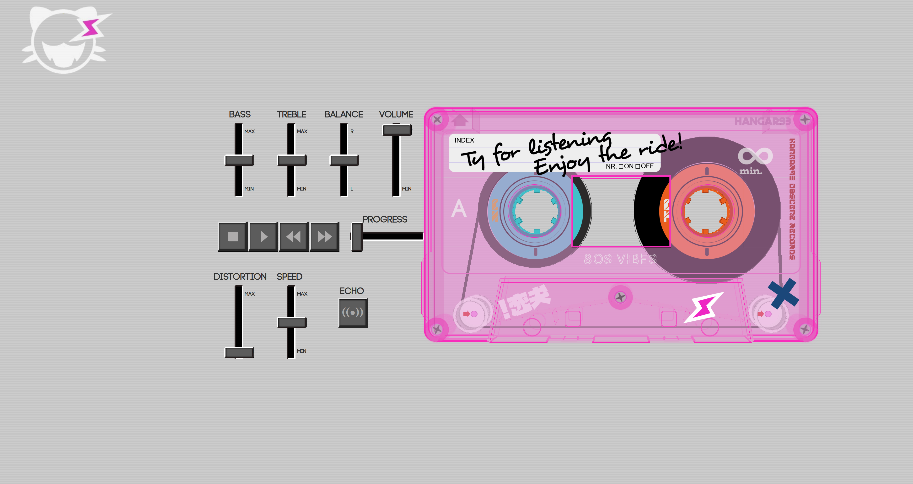
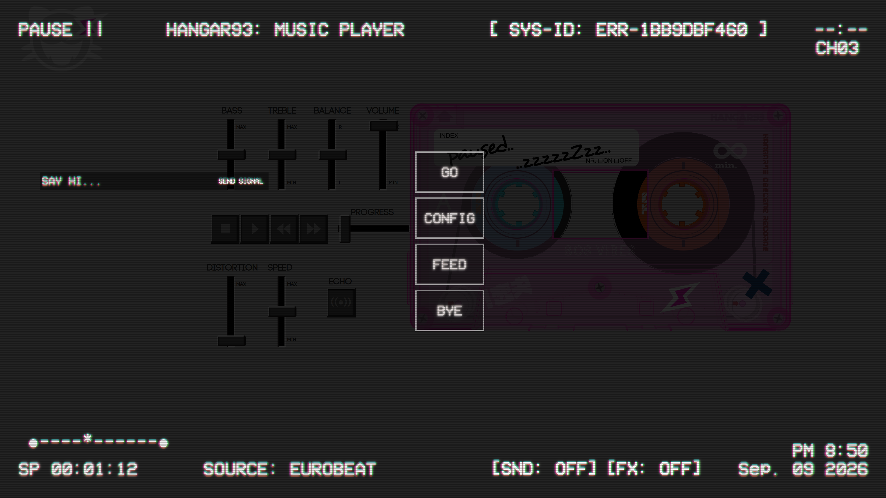

# HANGAR93 — Pseudo-Native Music Player

**HANGAR93** is a pseudo-native music player application designed to provide a personalized and fully local music management experience.

Built from scratch with **Vanilla JavaScript and pure CSS**, the project combines a retro-inspired interface with modern browser technologies such as **IndexedDB** for persistent local data storage.

The application was designed to feel more like a standalone desktop product than a traditional web application, with a custom interface, playlist management and interactive features.

## 🚀 Features

* 🎵 **Manual track management** — Add, edit and organize your own tracks.
* 📂 **Playlist management** — Create, rename, sort and manage personalized playlists.
* 🧠 **AI integration** — Basic AI functionality powered by OpenAI GPT-3.5.
* 💾 **Local persistence** — Playlists and application data are stored locally using IndexedDB.
* 📝 **Feedback system** — Integrated system for submitting feedback directly through the application.
* 🎨 **Custom retro UI** — A distinctive interface created entirely with HTML and pure CSS.
* 📱 **Responsive interface** — Designed to adapt to different screen sizes.
* 🖥️ **Pseudo-native experience** — Packaged as a desktop application to provide a more native-like experience.

## 🛠️ Technologies

* **Vanilla JavaScript**
* **HTML5**
* **Pure CSS**
* **IndexedDB**
* **OpenAI GPT-3.5**
* **Desktop application packaging**

## 🎯 Project Focus

HANGAR93 was created as an exploration of how far a browser-based application can be pushed toward a **desktop-like product experience without relying on large frameworks or complex front-end stacks**.

The project focuses on:

* Interface design
* Interaction design
* Local data management
* Responsive layouts
* Custom animations and UI systems
* JavaScript application architecture

## 📸 Screenshots

### HANGAR93 — Interactive 3D Music Player

### HANGAR93 — Interface

## 📦 Version

**HANGAR93 v1.1.2**

The application is distributed as a standalone executable and requires no traditional installation.

> **Note:** An internet connection is required for features that depend on external services, such as the AI functionality.

## 📝 License

This project is licensed under the **MIT License**.
